<div align="center">

# Practica 2 - Desarrollo de Software Seguro

**Universidad Catolica del Uruguay - Facultad de Ingenieria**

<br>

**Asignatura:** Desarrollo de Software Seguro <br>
**Estudiante:** Facundo Martinez <br>
**Fecha:** 24/09/2026

</div>

<br>

## Introduccion

El informe documenta el analisis y la mitigacion de diferentes vulnerabilidades del Practico 2.

Para cada ejercicio busca identificar la vulnerabilidad, comprender su causa, demostrar su explotacion mediante una prueba de concepto (POC), e implementar una modificacion que elimine la vulnerabilidad.

## Herramientas utilizadas

- **Git**
- **Visual Studio Code**
- **Docker**
- **Navegador web**


## Vulnerabilidades analizadas

1. **Ejercicio 1 - Inyeccion SQL (SQL Injection)**

2. **Ejercicio 2 - Cross-Site Scripting (XSS)**

3. **Ejercicio 3 - Carga de archivos sin restricciones**

4. **Ejercicio 4 - Server-Side Template Injection (SSTI)**

5. **Ejercicio 5 - Almacenamiento inseguro**


---
# Ejercicio 1 - Inyeccion SQL (SQL Injection)

## Marco teorico

La inyeccion SQL ocurre cuando datos controlados por el usuario se incorporan directamente a una consulta y son interpretados como codigo. Entradas como `' OR 1=1 --` o `UNION SELECT` pueden alterar la consulta y obtener informacion adicional. La mitigacion consiste en parametrizar los valores y validar mediante listas permitidas las columnas y direcciones de ordenamiento.

## Prueba de concepto (POC)

Para las siguientes pruebas primero se comprobo el comportamiento vulnerable y posteriormente se repitieron las pruebas despues de implementar la mitigacion. La implementacion actual de `Ejercicio1/app.py` ya contiene la mitigacion; los primeros resultados corresponden a la version vulnerable utilizada durante la prueba.

### POC 1 - Alteracion de la condicion con `OR 1=1`

Para comprobar la vulnerabilidad del campo de busqueda, se ingreso el siguiente valor:

```text
' OR 1=1 --
```

La comilla simple cierra el texto utilizado por el `LIKE`, mientras que `OR 1=1` incorpora una condicion que siempre es verdadera. Finalmente, `--` comenta el resto de la consulta original.

Como `1=1` siempre es verdadero, la aplicacion devuelve todas las funciones disponibles, aunque el texto ingresado no corresponda al nombre de una pelicula.

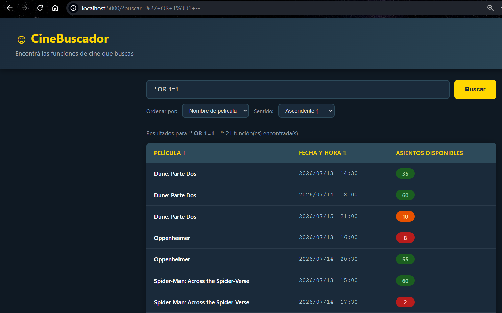

### POC 2 - Consulta de informacion mediante `UNION SELECT`

Para realizar esta prueba se utilizo primero un nombre de pelicula inexistente.
Luego se agrego una consulta mediante `UNION SELECT` para obtener informacion adicional de la base de datos.


```text
NoHayPeliculas' UNION SELECT name, '2020-00-01', 0 FROM sqlite_master WHERE type='table' --
```

La consulta inyectada debe devolver tres columnas, ya que el `SELECT` original tambien devuelve tres:

1. Nombre de la pelicula.
2. Fecha y hora.
3. Cantidad de asientos disponibles.

La utilizacion de `UNION SELECT` permite combinar el resultado original con informacion proveniente de otra tabla. En SQLite puede consultarse `sqlite_master` para obtener los nombres o las definiciones de las tablas existentes.

**Informacion obtenida:**

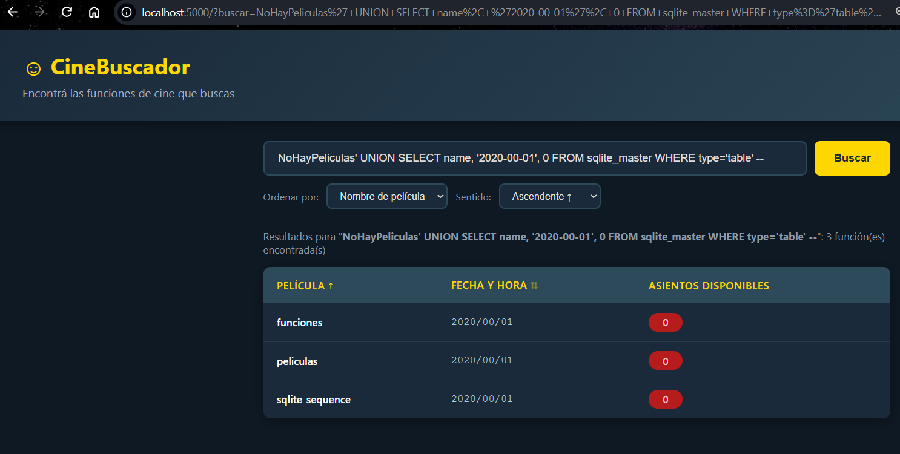

## Mitigacion

Para mitigar la vulnerabilidad se modifico la funcion `buscar_funciones()` aplicando dos medidas:

1. Parametrizacion del termino de busqueda.
2. Validacion de los valores utilizados para ordenar los resultados.

El codigo corregido quedo de la siguiente manera:

```python
def buscar_funciones(query, sort_by, sort_dir='ASC'):

    if sort_by == 'fecha':
        sort_by = 'funciones.fecha_hora'
    else:
        sort_by = 'peliculas.nombre'

    sort_dir=sort_dir.upper()
    if sort_dir not in ('ASC', 'DESC'):
        sort_dir = 'ASC'

    db = get_db()
    sql = f"SELECT peliculas.nombre as pelicula, funciones.fecha_hora, " \
          f"(funciones.asientos_totales - funciones.asientos_ocupados) as disponibles " \
          f"FROM funciones " \
          f"JOIN peliculas ON funciones.pelicula_id = peliculas.id " \
          f"WHERE peliculas.nombre LIKE ? " \
          f"ORDER BY {sort_by} {sort_dir}"
    return db.execute(sql, (f"%{query}%",)).fetchall()
```

### Parametrizacion de la busqueda

En la versiona con la vulnerabilidad el valor ingresado por el usuario se colocaba directamente dentro del SQL:

```python
f"WHERE peliculas.nombre LIKE '%{query}%' "
```

Esto permitia que una entrada con instrucciones SQL modificara la consulta.

Se reemplazo por un parametro:

```python
"WHERE peliculas.nombre LIKE ? "
```

El valor se envia separadamente al ejecutar la consulta:

```python
db.execute(
    sql,
    (f"%{query}%",)
)
```

De esta manera, SQLite interpreta todo el contenido de `query` como un dato y no como parte de la consulta SQL.

Los simbolos `%` se agregan al parametro para mantener la busqueda parcial realizada mediante `LIKE`.

### Validacion de la columna de ordenamiento

Los nombres de columnas no pueden parametrizarse utilizando `?`. Por este motivo, el valor recibido mediante `sort_by` se transforma en una columna definida por la aplicacion:

```python
if sort_by == 'fecha':
    sort_by = 'funciones.fecha_hora'
else:
    sort_by = 'peliculas.nombre'
```

Los unicos valores que pueden llegar al `ORDER BY` son:

```sql
funciones.fecha_hora
```

o

```sql
peliculas.nombre
```

Si se recibe cualquier otro valor, se utiliza `peliculas.nombre` como opcion predeterminada.

### Validacion del sentido de ordenamiento

El parametro `sort_dir` se obtiene desde la URL y, en la version vulnerable, se agregaba directamente al final de la consulta.

Primero se transforma el valor a mayusculas:

```python
sort_dir = sort_dir.upper()
```

Luego se verifica que sea uno de los dos sentidos permitidos:

```python
if sort_dir not in ('ASC', 'DESC'):
    sort_dir = 'ASC'
```

Esto evita que se agreguen nuevas instrucciones mediante el parametro `sentido` de la URL.

## Verificacion de la mitigacion

Despues de modificar el codigo, se repitieron las pruebas realizadas sobre la version vulnerable. El objetivo fue comprobar que la SQL injection ya no pudiera reproducirse y que las busquedas legitimas continuaran funcionando.

### Comprobacion 1 - Bloqueo de la inyeccion en el buscador

Se volvio a ingresar el valor utilizado anteriormente para modificar la condicion de la consulta:

```sql
' OR 1=1 --
```

En la version vulnerable, esta entrada provocaba que la condicion fuera siempre verdadera y mostraba todas las funciones.

Despues de la mitigacion, el valor es enviado separadamente mediante el parametro `?`:

```python
"WHERE peliculas.nombre LIKE ?"
```

```python
db.execute(sql, (f"%{query}%",))
```

SQLite interpreta la entrada completa como un texto que debe buscarse en el nombre de una pelicula. Por lo tanto, `OR 1=1` y `--` dejan de interpretarse como instrucciones SQL.

Como no existe una pelicula con ese contenido en su nombre, la aplicacion no devuelve resultados.

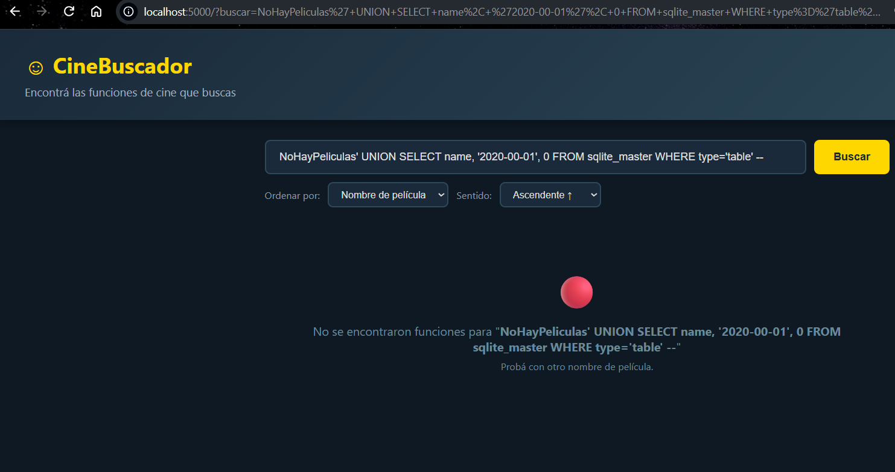
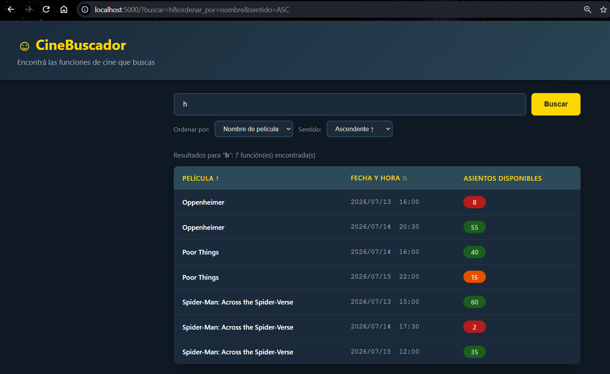

---

# Ejercicio 2 - Cross-Site Scripting (XSS)

## Marco teorico

XSS ocurre cuando una aplicacion muestra contenido controlado por el usuario y el navegador lo interpreta como HTML o JavaScript. En este caso es un XSS almacenado porque el contenido se guarda y se ejecuta al volver a mostrarlo. La mitigacion consiste en escapar la salida y evitar `safe` cuando el contenido no debe interpretarse como HTML.

## Prueba de concepto (PoC)

Para comprobar la vulnerabilidad se modifico la descripcion de una pelicula desde la pagina de edicion.

### POC 1 - Ingreso del codigo en la descripcion

Primero se ingreso el siguiente contenido en el campo `Descripcion`:

```html
<script>alert('XSS')</script>
```

Luego se presiono el boton `Guardar cambios`.

El contenido fue recibido por Flask y almacenado en la columna `descripcion` de la tabla `peliculas`.

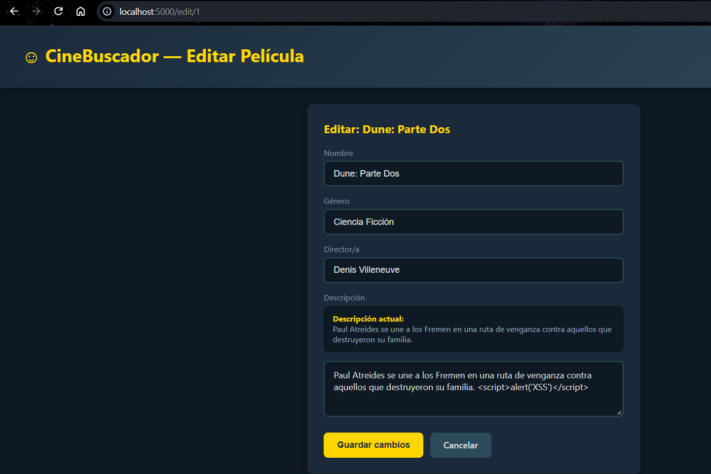

Despues de guardar los cambios, se volvio a abrir la pagina de edicion de la misma pelicula.

Como consecuencia de lo realizado anteriormente, el navegador interpreto la etiqueta `script` y ejecuto:

```javascript
alert('XSS')
```

La aparicion de la alerta demuestra que fue posible ejecutar JavaScript introducido por el usuario.

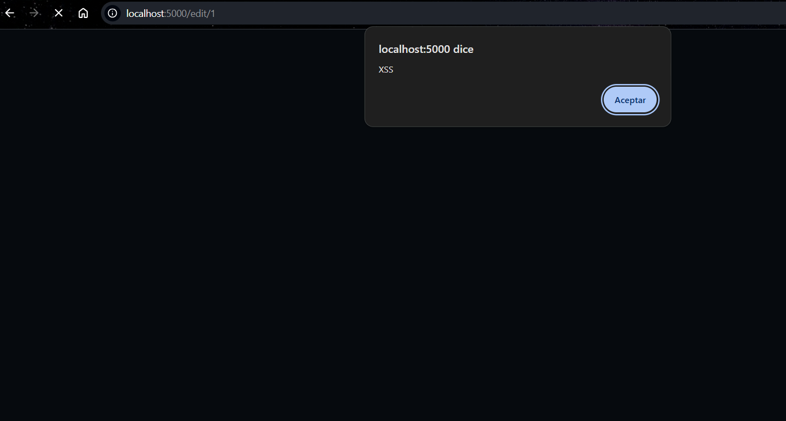


## Mitigacion

Para mitigar la vulnerabilidad se elimino el filtro `safe` utilizado al mostrar la descripcion.

El codigo vulnerable era:

```html
{{ pelicula['descripcion'] | safe }}
```

Se reemplazo por:

```html
{{ pelicula['descripcion'] }}
```

La seccion corregida de `edit.html` quedo de la siguiente manera:

```html

    <div class="prev-descripcion">
        <strong>Descripcion actual:</strong><br>
            {{ pelicula['descripcion'] }}
    </div>

```

La plantilla actual de `index.html` tambien muestra la descripcion sin `safe`. Sin embargo, el codigo actual de `Ejercicio2/app.py` todavia construye la consulta SQL interpolando `query` y `sort_dir`; por lo tanto, la mitigacion documentada corresponde al XSS, pero el ejercicio conserva un riesgo de SQL injection que deberia corregirse por separado.

## Verificacion de la mitigacion

Despues de eliminar el filtro `safe`, se repitieron las pruebas realizadas.

### Comprobacion - Bloqueo de la ejecucion de JavaScript

Se volvio a guardar el siguiente contenido en la descripcion:

```html
<script>alert('XSS')</script>
```

Despues se abrio nuevamente la edicion de la pelicula.

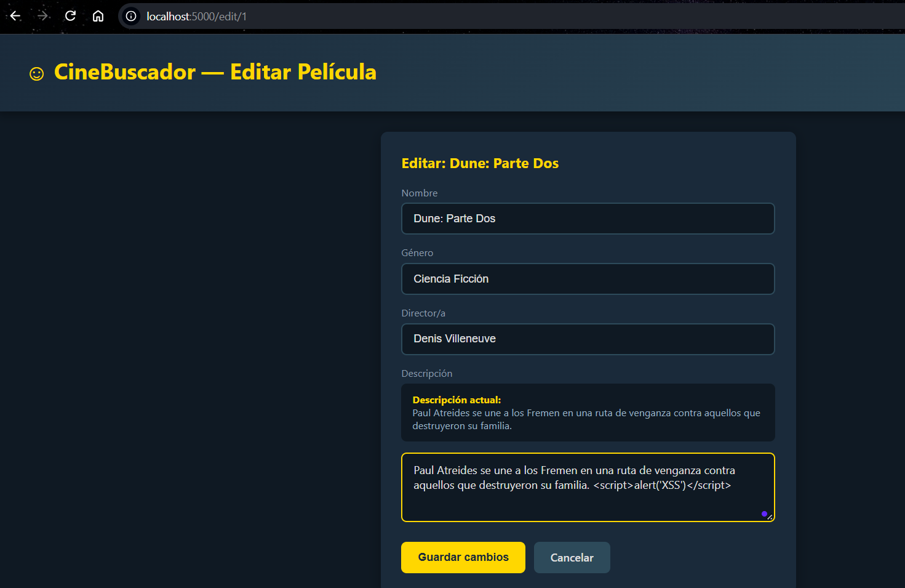

El contenido ingresado se mostro literalmente en la pagina:

```text
<script>alert('XSS')</script>
```

El navegador dejo de interpretarlo como codigo HTML o JavaScript.

<br>

---

# Ejercicio 3 - Carga de archivos sin restricciones

## Marco teorico

Una carga insegura ocurre cuando el servidor acepta archivos sin validar adecuadamente su tipo, extension, nombre y ubicacion. Esto puede permitir almacenar contenido no previsto y acceder a el mediante rutas predecibles. En este ejercicio se valida la extension y se genera un nombre aleatorio; no se verifica el contenido real del archivo ni su tipo MIME.


---

## Prueba de concepto (POC)


### POC 1 - Subida de cualquier archivo

El formulario permite seleccionar cualquier tipo de archivo. El principal problema se encuentra en el servidor, ya que el archivo se guarda sin validar su extension.

El servidor obtiene el nombre original y guarda directamente el archivo. No se comprueba si el archivo es realmente un afiche o si tiene una extension permitida.

---

Para comprobar la primera vulnerabilidad se selecciono un archivo de texto llamado `aa.txt`.

Aunque el formulario esta pensado para subir afiches, la aplicacion permite seleccionar el archivo sin mostrar ninguna restriccion.

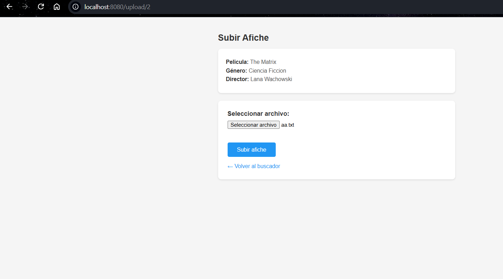

Luego de presionar el boton de subida, la aplicacion acepta y almacena el archivo.

Como el archivo no es una imagen, el navegador no puede mostrarlo correctamente como afiche.

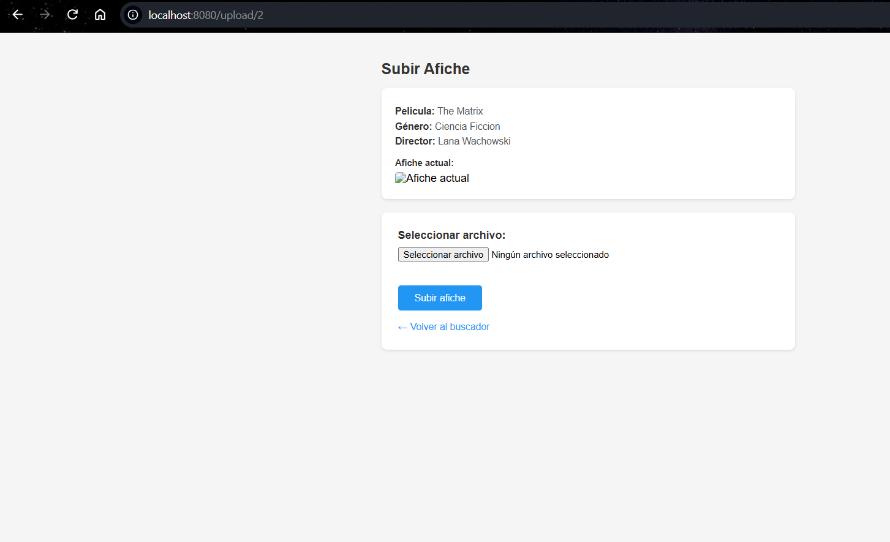

Esto demuestra que la validacion no se realizaba en el servidor y que era posible almacenar archivos con extensiones diferentes a las esperadas.

### POC 2 - Acceso utilizando el nombre original

### Uso del nombre original

El archivo tambien se almacena utilizando exactamente el nombre proporcionado durante la subida.

Como el archivo se almacena utilizando el nombre original, se conoce de antemano la ruta en la que se encuentra.

Se ingreso manualmente la siguiente direccion:

```text
http://localhost:8080/uploads/aa.txt
```

La aplicacion devolvio el contenido del archivo subido.

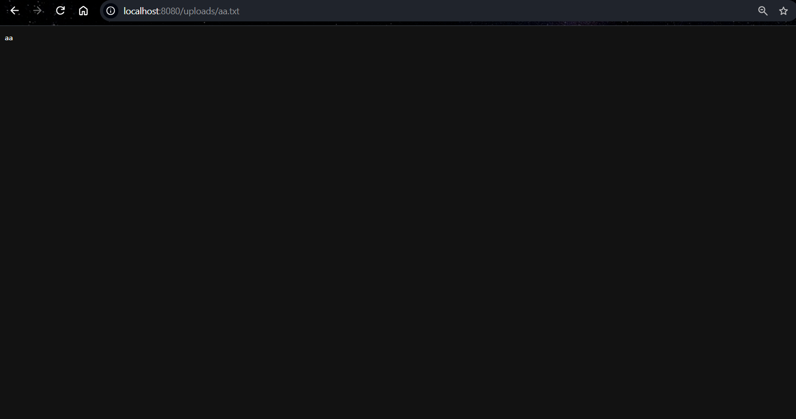

Por lo tanto, cualquier persona que conozca o pueda adivinar el nombre del archivo puede intentar acceder a el mediante la ruta publica de archivos.

---

## Mitigacion

Para corregir las vulnerabilidades se realizaron dos cambios principales:

1. Validar la extension del archivo antes de almacenarlo.
2. Reemplazar el nombre original por un UUID aleatorio.

### Validacion de la extension

Primero se obtiene el nombre original del archivo:

```java
String nombreOriginal = archivo.getOriginalFilename();
```

Se comprueba que el nombre exista y que tenga una extension:

```java
if (nombreOriginal == null || !nombreOriginal.contains(".")) {
    return "redirect:/upload/" + id;
}
```

Luego se obtiene la extension:

```java
int i = nombreOriginal.lastIndexOf('.');

String extension = nombreOriginal
    .substring(i + 1)
    .toLowerCase();
```

Finalmente, se permite solamente la subida de archivos con extension `png`, `jpg` o `jpeg`:

```java
if (!List.of("png", "jpg", "jpeg").contains(extension)) {
    return "redirect:/upload/" + id;
}
```

Si el archivo no tiene una extension permitida, la aplicacion vuelve al formulario y no almacena el archivo. Esta comprobacion se basa solamente en el nombre y no confirma que el contenido sea realmente una imagen.

### Generacion de un nombre aleatorio

Para evitar utilizar el nombre original se genera un UUID:

```java
String uuidAleatorio = UUID.randomUUID().toString();
String filename = uuidAleatorio + "." + extension;
```

Por ejemplo, un archivo llamado:

```text
capa8.jpg
```

puede almacenarse con un nombre similar al siguiente:

```text
62b207d8-67f6-46d6-9eb5-6aa592a0a8b7.jpg
```

De esta forma, el usuario no controla el nombre final utilizado por el servidor y la direccion del archivo deja de ser facilmente predecible.

### Codigo corregido

El metodo de subida queda de la siguiente manera:

```java
@PostMapping("/upload/{id}")
public String uploadFile(
        @PathVariable Integer id,
        @RequestParam("afiche") MultipartFile archivo
) throws IOException {

    Pelicula pelicula = peliculaRepo.findById(id)
        .orElseThrow(() ->
            new EntityNotFoundException("Pelicula no encontrada")
        );

    String nombreOriginal = archivo.getOriginalFilename();

    if (nombreOriginal == null || !nombreOriginal.contains(".")) {
        return "redirect:/upload/" + id;
    }

    int i = nombreOriginal.lastIndexOf('.');

    String extension = nombreOriginal
        .substring(i + 1)
        .toLowerCase();

    if (!List.of("png", "jpg", "jpeg").contains(extension)) {
        return "redirect:/upload/" + id;
    }

    String uuidAleatorio = UUID.randomUUID().toString();
    String filename = uuidAleatorio + "." + extension;

    Path uploadPath = Paths.get(uploadDir);

    if (!Files.exists(uploadPath)) {
        Files.createDirectories(uploadPath);
    }

    Files.copy(
        archivo.getInputStream(),
        uploadPath.resolve(filename)
    );

    pelicula.setAfichePath(filename);
    peliculaRepo.save(pelicula);

    return "redirect:/";
}
```

Tambien es necesario importar `UUID`:

```java
import java.util.UUID;
```

---

## Verificacion de la mitigacion

### Intento de carga de un archivo no permitido

Para verificar la validacion se selecciono nuevamente el archivo `aa.txt`.

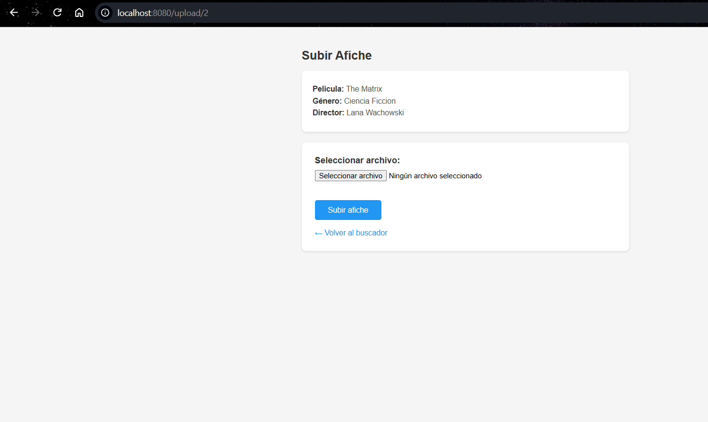

La extension `txt` no se encuentra dentro de las extensiones permitidas, por lo que el servidor debe rechazarla al enviar el formulario.

### Comprobacion de una imagen permitida

Luego de realizar una carga valida con una imagen JPG, la aplicacion regreso al formulario.

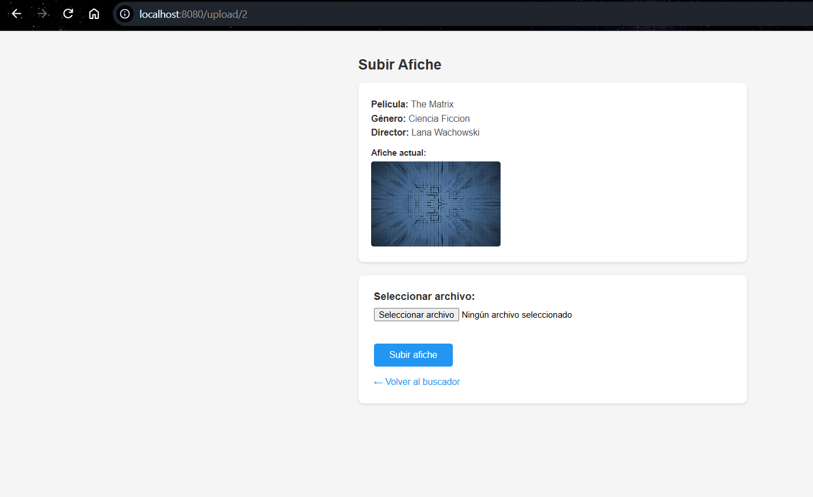

La aplicacion acepto el archivo y el afiche se mostro correctamente.

Esto comprueba que las extensiones permitidas pueden continuar siendo utilizadas normalmente.

### Comprobacion del cambio de nombre

Despues de subir la imagen se intento acceder utilizando su nombre original:

```text
http://localhost:8080/uploads/afiche.JPG
```

El servidor respondio con un error `404`, ya que el archivo no fue almacenado con ese nombre.

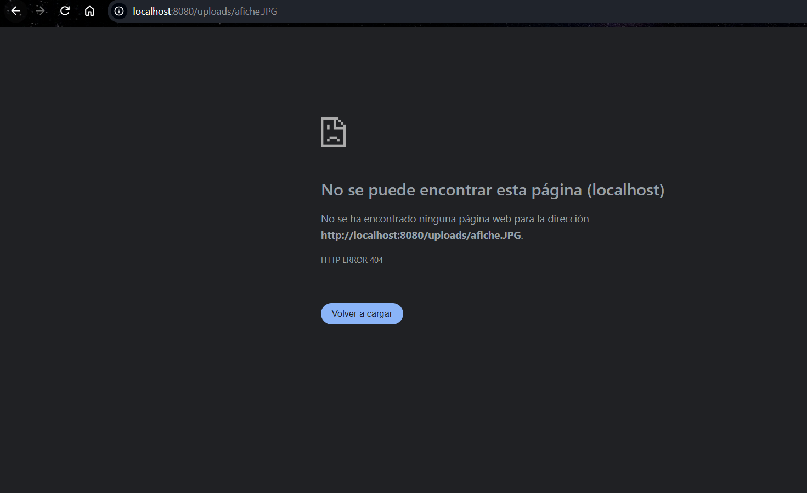

---


# Ejercicio 4 - Server Side Template Injection

## Marco teorico

SSTI ocurre cuando una entrada controlada por el usuario se envia a un motor de expresiones y se ejecuta en lugar de tratarse como texto. Por ejemplo, `2*4` puede evaluarse como `8`, mientras que otras entradas pueden producir errores o acceder a informacion interna. La mitigacion consiste en eliminar la evaluacion innecesaria y usar la entrada solamente como texto.

## Prueba de concepto (POC)

Para confirmar que la entrada estaba siendo interpretada por SpEL, se ingreso:

```text
2*4
```

La aplicacion interpreto la expresion y mostro:

```text
Resultados buscando por: 8
```

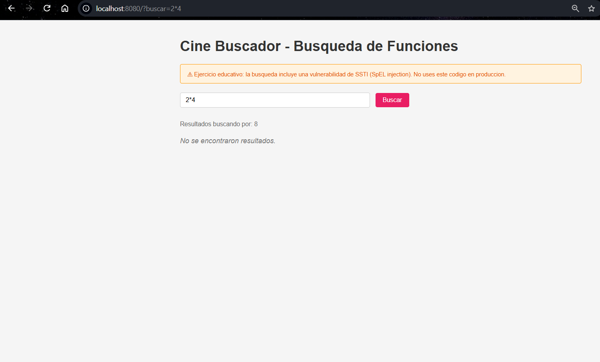

Despues de eliminar la evaluacion de expresiones, se ingreso nuevamente `2*4`. La aplicacion trato la entrada como texto y no encontro coincidencias. La interfaz conserva el aviso educativo de SSTI, pero el resultado confirma que la expresion ya no se evalua.

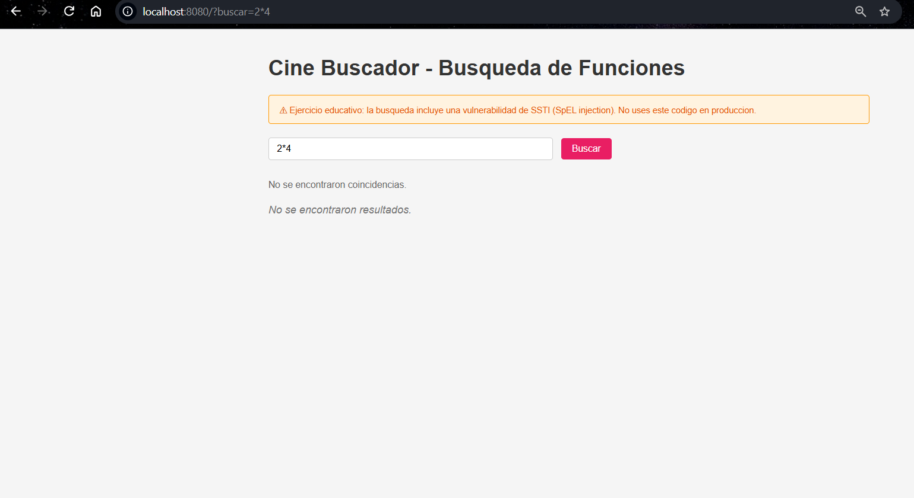

Tambien se comprobo una busqueda normal utilizando `matrix`, que devuelve resultados de la aplicacion. El aviso educativo visible pertenece a la interfaz y no implica que la entrada haya sido evaluada.

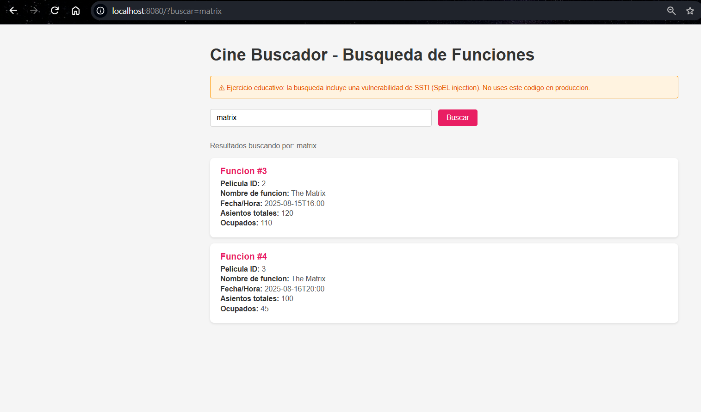

Estas capturas corresponden a la comparacion entre la version vulnerable y la version corregida. En el codigo actual, el controlador usa `contains()` para buscar el texto y la llamada a SpEL permanece comentada.

## Mitigacion

La vulnerabilidad de la version anterior se producia porque el parametro `buscar` se enviaba a `SpelEvaluator`:

```java
String spelResultado = spelEval.evaluate(buscar);
```

Sin embargo, la funcionalidad solamente necesita comparar el texto ingresado con los nombres de las funciones. No existe ninguna necesidad de interpretar expresiones spel.

Por este motivo, se desactivo la evaluacion y se comenzo a utilizar directamente el contenido de `buscar`.

### Desactivacion de SpelEvaluator

La importacion de `SpelEvaluator` y la clase auxiliar aun existen, pero la llamada a `evaluate()` esta comentada y no participa del flujo actual. La dependencia de SpEL tampoco fue eliminada del proyecto.

### Controlador corregido

El metodo de busqueda utiliza ahora el parametro `buscar` directamente como texto:

```java
@GetMapping("/")
public String search(
        @RequestParam(required = false) String buscar,
        Model model
) {
    model.addAttribute("query", buscar != null ? buscar : "");

    if (buscar == null || buscar.isBlank()) {
        List<Funcion> todas = funcionRepo.findAll();
        model.addAttribute("resultados", todas);
        model.addAttribute("mensaje", "Mostrando todas las funciones.");
        return "index";
    }

    List<Funcion> resultados = funcionRepo.findAll().stream()
        .filter(f -> f.getNombreFuncion() != null &&
            f.getNombreFuncion().toLowerCase().contains(buscar.toLowerCase()))
        .collect(Collectors.toList());

    model.addAttribute("resultados", resultados);

    if (resultados.isEmpty()) {
        model.addAttribute("resultados", new ArrayList<Funcion>());
        model.addAttribute("mensaje", "No se encontraron coincidencias.");
        return "index";
    }
    model.addAttribute("mensaje", "Resultados buscando por: " + buscar);
    return "index";
}
```

Con esta modificacion, la entrada permanece como un `String` y no se envia al interprete de expresiones. Como tarea pendiente, convendria eliminar la clase, la importacion y la dependencia de SpEL si no se utilizan en otra parte.

---

# Ejercicio 5 - Almacenamiento inseguro

## Marco teorico

Almacenar contraseñas con cifrado reversible, como AES/ECB, permite recuperarlas si se obtiene la clave y produce el mismo resultado para contraseñas iguales. Una clave fija dentro del codigo agrava el problema. Las contraseñas deben almacenarse con un hash resistente como BCrypt, que incorpora un valor aleatorio y se verifica sin descifrarlas.

## Prueba de concepto (POC)

Las siguientes capturas corresponden a la version vulnerable utilizada para la POC. El codigo actual del ejercicio ya utiliza BCrypt.

En la version vulnerable, las contraseñas eran cifradas utilizando `AES-256` en modo `ECB`:

```java
private static final String CIPHER_ALGO = "AES/ECB/PKCS5Padding";
```

Ademas, la clave utilizada para realizar el cifrado se encuentra directamente dentro del codigo fuente:

```java
private static final String SECRET_KEY = "MySup3rS3cr3tK3y!2024CineBuscadorAES";
```

El principal problema es que AES es un algoritmo de cifrado reversible. Por lo tanto, si se obtiene el valor cifrado y la clave utilizada por la aplicacion, es posible recuperar la contraseña original.

Adicionalmente, el modo `ECB` utilizado por la aplicacion es predecible: al cifrar dos veces exactamente la misma contraseña con la misma clave se obtiene el mismo resultado.

Para demostrar estos problemas se realizaron las siguientes pruebas.

### POC 1 - Comparacion de dos usuarios con la misma contraseña

Primero se creo un usuario:

```text
Usuario: facu
Contraseña: [contra]
```

Luego se inicio sesion con el usuario.

Despues de realizar correctamente el inicio de sesion, la aplicacion muestra el valor cifrado correspondiente a la contraseña:

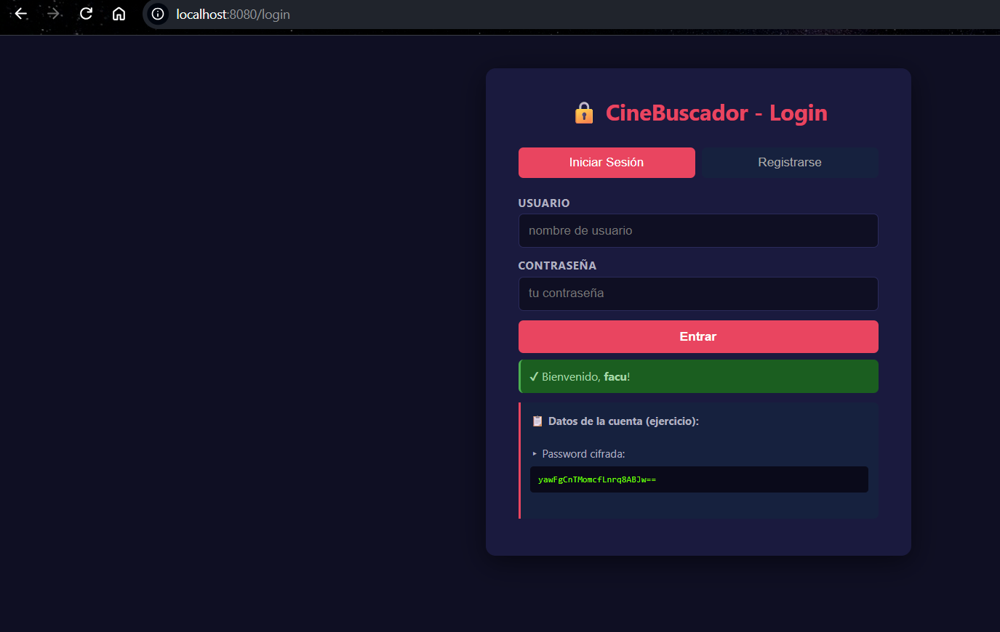

Posteriormente se creo un segundo usuario diferente:

```text
Usuario: facundo
Contraseña: [contra]
```

Se utilizo exactamente la misma contraseña que para el primer usuario.

Despues de iniciar sesion con `facundo`, la aplicacion mostro nuevamente la contraseña cifrada.

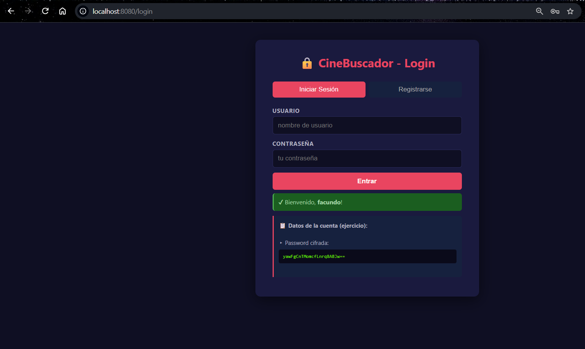

Al comparar ambos resultados se puede observar que los dos usuarios poseen exactamente el mismo valor cifrado:

Esto ocurre porque la aplicacion utiliza:

```java
AES/ECB/PKCS5Padding
```

y siempre utiliza la misma clave para realizar el cifrado, por este motivo, una misma entrada produce el mismo ciphertext.

Esto permite identificar patrones entre las contraseñas almacenadas. Por ejemplo, aunque inicialmente no se conozca cual es la contraseña utilizada, puede determinarse que dos usuarios están utilizando exactamente la misma.

## Mitigacion

Para mitigar la vulnerabilidad se elimino el cifrado reversible de las contraseñas mediante AES y se reemplazo por el uso de `BCryptPasswordEncoder`. Esta es la implementacion que actualmente aparece en `Ejercicio5`.

El principal problema de la version vulnerable era que las contraseñas se almacenaban utilizando AES. Al tratarse de un algoritmo de cifrado reversible, una persona que consiguiera el valor cifrado y la clave utilizada por la aplicacion podia recuperar la contraseña original.

Ademas, la clave utilizada para realizar el cifrado se encontraba escrita directamente dentro del codigo fuente:

```java
private static final String SECRET_KEY = "MySup3rS3cr3tK3y!2024CineBuscadorAES";
```

Por este motivo, se elimino el uso de AES para el almacenamiento de contraseñas y se comenzo a utilizar BCrypt. La clase actual aun conserva imports de AES que no se utilizan, pero no los usa para registrar ni autenticar usuarios.

### Uso de BCrypt

En `EncryptionService` se creo una instancia de `BCryptPasswordEncoder`:

```java
private static final BCryptPasswordEncoder passwordEncoder = new BCryptPasswordEncoder();
```

A diferencia del cifrado AES utilizado anteriormente, BCrypt genera un hash que no necesita ser descifrado para realizar el inicio de sesion.

Para almacenar una contraseña se utiliza:

```java
public static String hashPassword(String password) {
    return passwordEncoder.encode(password);
}
```

De esta manera, la contraseña ingresada por el usuario se transforma en un hash antes de ser almacenada.

La clase `EncryptionService` corregida queda de la siguiente manera:

```java
package com.cinebuscador.config;

import javax.crypto.Cipher;
import javax.crypto.spec.SecretKeySpec;
import java.nio.charset.StandardCharsets;
import java.util.Arrays;
import java.util.Base64;

import org.springframework.security.crypto.bcrypt.BCryptPasswordEncoder;

public class EncryptionService {

    private static final BCryptPasswordEncoder passwordEncoder = new BCryptPasswordEncoder();

    private EncryptionService() {
    }

    public static String hashPassword(String password) {
        return passwordEncoder.encode(password);
    }

    public static boolean verifyPassword(String password, String hashedPassword) {
        return passwordEncoder.matches(password, hashedPassword);
    }
}
```

Con esta modificacion ya no existe una clave AES dentro del codigo y tampoco existen metodos para cifrar o descifrar contraseñas.

---

### Modificacion del registro de usuarios

En la version vulnerable, la contraseña era cifrada antes de almacenarse utilizando AES.

Luego de la mitigacion, al registrar un nuevo usuario se genera un hash utilizando BCrypt:

```java
com.cinebuscador.model.User nuevoUsuario = new com.cinebuscador.model.User();
nuevoUsuario.setUsername(username);
nuevoUsuario.setPassword(EncryptionService.hashPassword(password));
userRepository.save(nuevoUsuario);
```

Por lo tanto, el valor almacenado en la base de datos ya no corresponde a una contraseña cifrada que pueda ser recuperada posteriormente.

---

### Modificacion del inicio de sesion

Como la contraseña ya no puede ni necesita ser descifrada, tambien se modifico el proceso de inicio de sesion.

Primero se obtiene el hash almacenado correspondiente al usuario:

```java
String userHashedPassword = user.getPassword();
```

Luego se utiliza el metodo `verifyPassword()`:

```java
String userHashedPassword = user.getPassword();

if (EncryptionService.verifyPassword(password, userHashedPassword)) {
    model.addAttribute("loginSuccess", true);
    model.addAttribute("welcomeUser", username);
    return "index";
}
```

Internamente, este metodo utiliza:

```java
passwordEncoder.matches(password, hashedPassword);
```

BCrypt toma la contraseña ingresada durante el login y comprueba si corresponde con el hash almacenado.

No es necesario recuperar la contraseña original en ningun momento.

---

De esta manera, la aplicacion deja de almacenar contraseñas utilizando un mecanismo reversible y tampoco mantiene una clave criptografica estatica dentro del codigo fuente.

Ademas, BCrypt incorpora un valor aleatorio en la generacion de cada hash. Por este motivo, dos usuarios que utilicen exactamente la misma contraseña pueden tener hashes diferentes.